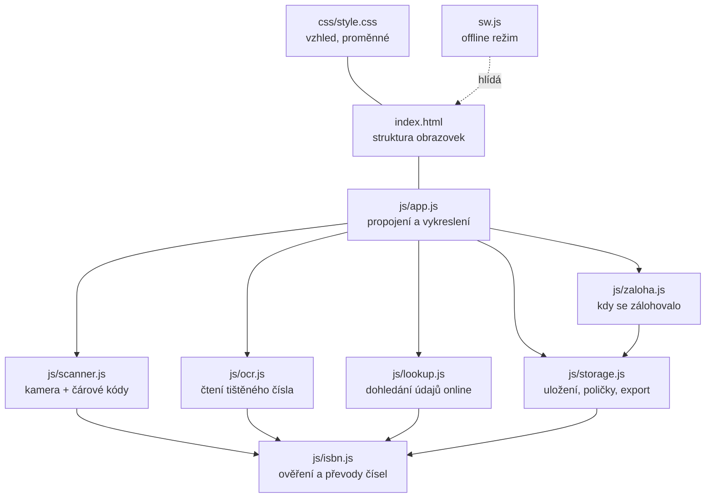
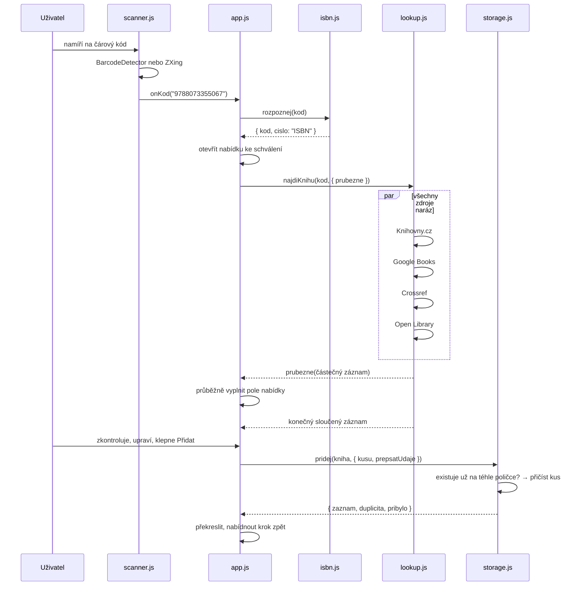

# Architektura

Jak je aplikace poskládaná a proč zrovna takhle. Čtěte jako první —
[Moduly](moduly.md) a [Datový model](datovy-model.md) na tenhle text navazují.

---

## Tři rozhodnutí, ze kterých plyne všechno ostatní

**1. Žádný server.** Aplikace je statická stránka na GitHub Pages. Nemá backend,
databázi ani přihlašování. Data o knihách žijí v `localStorage` prohlížeče,
který je pořídil, a ven se dostanou jen souborem, který si uživatel sám stáhne.
Důsledek: nic není sdílené mezi zařízeními, zálohu musí udělat člověk, a naopak —
provoz nic nestojí, není co spravovat a nejsou kde uniknout data.

**2. Žádný build.** V repozitáři leží přesně to, co běží v prohlížeči. Není tu
webpack, TypeScript, transpilace ani `dist/`. JavaScript jsou nativní ES moduly
(`<script type="module">`), CSS je jeden soubor. Kdo chce něco změnit, otevře
soubor, změní ho a je hotovo — bez `npm run build`. Cena je, že se nedá použít
nic, co prohlížeč neumí sám, a že velikost souborů nikdo neoptimalizuje.

**3. Žádné CDN.** Všechny cizí knihovny (ZXing, Tesseract, isbn3, písma IBM Plex)
jsou nakopírované ve `vendor/`. Aplikace tak funguje offline a při skenování
neposílá IP adresu telefonu na cizí servery. Cena je, že aktualizace knihovny
znamená ruční výměnu souboru — viz [Úpravy](upravy.md#výměna-knihovny-ve-vendor).

Externě se aplikace ptá **jedině na údaje o knize**, a to až ve chvíli, kdy se
naskenuje kód. Nic jiného ven neodchází.

---

## Mapa modulů

Šipky jsou závislosti (`import`). Stojí za povšimnutí, že jdou jen jedním
směrem: **`app.js` zná všechny, ostatní moduly neznají `app.js`**. Žádný modul
kromě `app.js` nesahá na DOM (výjimkou je `storage.stahni()`, které stahuje
soubor, a `scanner`/`ocr`, které pracují s prvkem `<video>` a `<canvas>` —
dostanou ho ale zvenčí, nehledají si ho samy).

Praktický důsledek: **logika jde testovat v Node bez prohlížeče**. Přesně to
dělá `tests/jednotky.mjs`.

### Kdo je za co zodpovědný

| Modul | Zodpovídá za | Nezodpovídá za |
|---|---|---|
| `isbn.js` | co je platné číslo, převody, pomlčky | odkud číslo přišlo |
| `scanner.js` | kamera, čtení EAN-13, světlo | co kód znamená |
| `ocr.js` | obraz → text → kandidáti na ISBN | zobrazení čtecího proužku |
| `lookup.js` | dotazy do katalogů, sloučení odpovědí | uložení výsledku |
| `storage.js` | trvalost dat, poličky, kusy, CSV/JSON | vykreslení |
| `zaloha.js` | evidence poslední zálohy | samotný export |
| `app.js` | obrazovky, události, spojení všeho | pravidla nad čísly a daty |

Když se nová vlastnost dá napsat tak, že `app.js` jen zavolá funkci z modulu,
je to skoro vždycky správně. Když `app.js` začne počítat kontrolní číslice nebo
skládat CSV, patří ta část jinam.

---

## Tok dat: cesta jedné knihy

Nejdůležitější scénář aplikace, od namíření kamery po řádek v tabulce.

Tři místa, kde se to liší od naivní implementace, a proč:

**Zdroje se ptají naráz, ne popořadě.** Jeden katalog zná název a autora, jiný
má jen obálku — dohromady dají úplnější záznam. Výpadek jednoho navíc
nezastaví ostatní.

**Odpovědi se hlásí průběžně, ale skládají se v pořadí zdrojů.** Nabídka se
vyplní hned, jak dorazí první použitelná odpověď. Kdyby ale o výsledku
rozhodovalo pořadí příchodu, u české knihy by vyhrál anglický název z Google
Books jen proto, že jeho server odpoví dřív. Proto je `ZDROJE` seřazené a
české katalogy jsou první: když Knihovny.cz doběhnou později, pole se přepíše
na jejich hodnotu. Podrobně v `lookup.js`, funkce `slozZOdpovedi`.

**Nic se neuloží samo.** Mezi skenem a uložením vždycky stojí nabídka ke
schválení. Skener se totiž umí splést a načíst kód sousední knihy — a ten má
platnou kontrolní číslici, takže ho žádná kontrola nechytí. Jediná pojistka
je lidská pozornost, a proto je potvrzení povinné a každá akce jde vzít zpět
(`storage.snimek()` / `obnovSnimek()`).

---

## Stavy a obrazovky

`app.js` drží stav v několika málo modulových proměnných; není tu žádný
framework ani reaktivní vrstva. Překreslení je vždycky explicitní volání
`vykresli()`, které přepíše seznam knih z `localStorage`.

| Proměnná | Co drží |
|---|---|
| `aktivniZalozka` | `skener` \| `knihovna` \| `vic` |
| `nabizenaKniha` | rozpracovaná kniha v nabídce ke schválení (nebo `null`) |
| `poradiNabidky` | pořadové číslo nabídky — zahodí odpověď z hledání, které už neplatí |
| `rucneUpravena` | pole, do kterých uživatel sáhl; dohledané údaje je nepřepíšou |
| `vybrane`, `rezimVyberu` | hromadné akce |
| `razeni`, `zobrazenyStav`, `otevrenePolicky` | zobrazení knihovny |
| `nedavnoPridane` | seznam *Právě přidané* na skenovací záložce |
| `varianta`, `prouzek` | uložené předvolby (řádky/karty, čtecí proužek) |

Obrazovky jsou tři `<section class="obrazovka">` v `index.html`, přepínají se
atributem `hidden` (funkce `prepniZalozku`). Na širokém displeji se přes
media query zobrazí skener a knihovna vedle sebe — obrazovky se tím
nepřepínají, jen jinak rozloží.

Modální okna jsou dvojího druhu: **překryv** (`#prekryv`) pro nabídku ke
schválení a **spodní listy** (`.list` / sheet) pro detail knihy, ruční zadání
a výběr poličky.

---

## Offline režim a doručení nové verze

`sw.js` je service worker se dvěma strategiemi:

- **Vlastní soubory aplikace** (`index.html`, `js/`, `css/`) — **nejdřív síť**,
  cache až když spojení selže. Tohle pořadí je zásadní: dřív to bylo obráceně
  a jednou uložený soubor se už nikdy nenahradil, takže na telefonu běžela
  stará verze i dlouho po vydání oprav.
- **`vendor/`** — **nejdřív cache**. Tyhle soubory se mění jen s novou verzí
  a Tesseract má sám o sobě 7 MB.

Cizí adresy (katalogy, obálky) přes service worker vůbec neprocházejí.

Konstanta `VERZE` v `sw.js` pojmenovává cache. Při aktivaci se všechny cache
s jiným jménem smažou — proto se **při každé změně souborů ve `vendor/` nebo
v seznamu `ZAKLAD` musí `VERZE` zvýšit**. U běžné změny v `js/` to nutné není
(soubor se stejně bere ze sítě), ale škodit to nemůže.

Že tohle všechno drží, hlídá `tests/aktualizace.mjs` — viz [Vývoj](vyvoj.md#testy).
